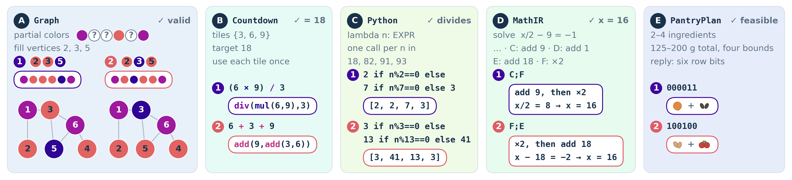

# ModeBench

**Can a model find more than one correct solution to the same problem?** ModeBench evaluates correctness and solution diversity using executable tasks with canonical outcome identities.

[](docs/assets/modebench-domains.png)

*The five ModeBench domains, with two verified solution modes for each example. Click the figure to view it at full resolution.*

It includes **five domains**, **five task levels**, and **72 frozen dataset splits** (15,552 rows). You can evaluate saved model responses on CPU without PyTorch, CUDA, or a training framework.

| Domain | What is checked | What defines a mode |
| --- | --- | --- |
| Graph coloring | Every graph edge and fixed color | Complete color vector |
| Countdown | Exact arithmetic and use of the given operands | Normalized executed expression tree |
| Python factors | A restricted function returns proper divisors on the given inputs | Returned divisor vector |
| MathIR | Restricted equation actions execute correctly | Exact normalized state trajectory |
| PantryPlan | Ingredient and nutritional feasibility constraints | Ingredient support |

A mode represents the domain's executed outcome. Different wording alone does not create a different mode; for Python, different programs can produce the same divisor vector.

## Quick start

Use Python 3.10 or later on Linux or macOS. The external Python verifier uses POSIX process primitives; Windows users should use WSL.

```sh
git clone https://github.com/liv-daliberti/modeBench.git
cd modeBench
python3 -m venv .venv
source .venv/bin/activate
python -m pip install -e '.[dev]'
modebench evaluate examples/responses.jsonl --output outputs/example.json
```

This grades the small saved-response example and writes metrics plus per-response verification results. It makes no model calls. Use a new output filename for each run; existing results are never overwritten.

```sh
make check
```

This runs the regression suite, checks the 375-cell frozen base-grid analysis, and verifies every bundled dataset file against its recorded SHA-256.

For evaluation alone, `python -m pip install -e .` installs the core package. Use `.[data]` for dataset loading and construction tools, or `.[dev]` for those tools plus tests. The datasets and evidence are included in the Git checkout, rather than the Python wheel.

## Evaluate your model

Load a frozen split and render the registered prompt:

```python
from modebench.data import load_split
from modebench.prompts import make_messages
from modebench.historical_prompts import grade_response

rows = load_split("data", "level1_countdown", "eval")
row = rows[0]
messages = make_messages(1, "countdown", row)
# Send only `messages` to your model, then grade its returned text:
result = grade_response(1, "countdown", row, "YOUR_MODEL_RESPONSE")
print(result)  # verified, canonical_key, graded_text
```

For batch evaluation, save one JSONL record per prompt with `id`, `level`, `domain`, `answer`, and `responses`, then run `modebench evaluate`. The [evaluation guide](docs/evaluation.md) gives the complete schema, output interpretation, and reporting protocol. The [walkthrough](docs/getting-started.md) covers collecting responses without exposing reference answers to the model.

## Metrics

- **Accuracy:** fraction of generated responses that verify.
- **Empirical pass@k:** fraction of prompts with at least one verified response among their k saved draws.
- **Distinct@k:** mean number of different verified modes among those k draws.
- **PCMD:** probability estimate that a pair of verified responses occupies different modes, averaged equally across prompts where it is defined.

PCMD is undefined for a prompt with fewer than two verified responses. Always report its eligible-prompt count and support. The default reporting threshold is 30 eligible prompts per cell. The tiny quick-start example is intentionally below that threshold. See [metric definitions and examples](docs/evaluation.md#metric-definitions).

## Datasets and protocol

The [dataset guide](docs/datasets.md) lists every configuration, split size, task interface, and admission caveat. Frozen Parquet bytes and split membership are preserved from the retained release packages.

**Level 4 MathIR is not difficulty-matched.** The other four Level 4 domains passed their matching checks; Level 4 as a whole is not admitted. All five Level 5 domains are admitted according to the retained release manifest. These labels do not establish statistical equivalence between levels.

Bundled Level 3 data use the historical `registered_hints_v1` prompt condition. The separately calibrated neutral-Python Level 3 dataset is not included; changing its wording would change the protocol.

## Reproducibility and scope

This repository owns benchmark definitions, validation, canonical identities, frozen data, and evaluation. Re:Max / Re:Dr optimization and training are maintained separately; they are not required to use ModeBench.

The [reproducibility guide](docs/reproducibility.md) distinguishes dataset verification, saved-key analysis, response regrading, and new model evaluation. The 375-cell check reproduces retained analysis from saved verified keys; it does not regenerate model responses or certify every historical runtime.

| Guide | Contents |
| --- | --- |
| [Getting started](docs/getting-started.md) | Installation, a complete evaluation workflow, troubleshooting |
| [Datasets](docs/datasets.md) | All configurations, split sizes, prompts, domain interfaces |
| [Evaluation](docs/evaluation.md) | JSONL schema, metric formulas, aggregation, reporting |
| [Reproducibility](docs/reproducibility.md) | Evidence, checksums, version identities, construction tools |
| [Contributing](CONTRIBUTING.md) | Tests and scientific compatibility expectations |
| [Release scope](RELEASE_STATUS.md) | Included functionality and known gaps |
| [Validation](VALIDATION.md) | Checks actually performed for this release |

## License and attribution

Code is licensed under [Apache 2.0](LICENSE); original copyright notices are retained. Dataset source terms are recorded separately in [license provenance](provenance/levels123_LICENSE_PROVENANCE.md). This code license does not assign new rights to upstream data.

When citing or reporting results, include the repository URL and commit, dataset configuration and hashes, prompt condition, model revision, decoding settings, draw budget, and PCMD support. See the [reporting checklist](docs/evaluation.md#reporting-results).
